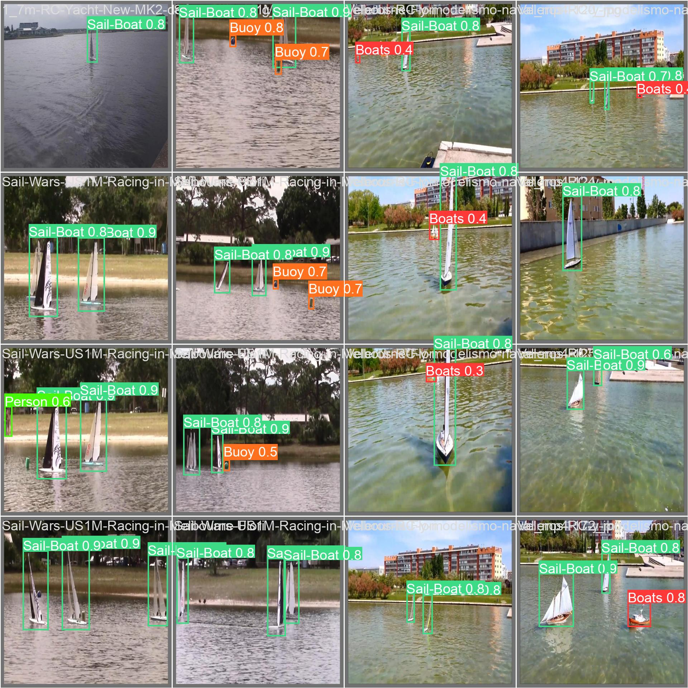

# Onboard Obstacle Detection for an Autonomous Sailboat

Undergraduate thesis in Electronic Engineering, Universidad de Antioquia (SISTEMIC research group), 2024. Real-time maritime obstacle detection with YOLOv8 on a low-cost single-board computer, combined with a gimbal-mounted camera and a single-point LiDAR for range estimation.



Full report (Spanish): [informe-Final-FelipeAyala-Trabajo de grado.pdf](informe-Final-FelipeAyala-Trabajo%20de%20grado.pdf)

## Problem

An autonomous sailboat must detect and range obstacles before it can plan an avoidance maneuver, but the maritime setting removes most of the usual options: scanning LiDAR and marine radar are too expensive for a research prototype, and stereo vision is geometrically limited (with an 8 mm focal length and a 120 mm baseline the maximum measurable distance is under 1 m, far too short for a boat). The real constraint was that everything had to run on board: inference on a battery-powered SBC drawing about 6 W, with no network link and no offboard compute. The approach taken here replaces the dense point cloud with a detector that decides where to look, and a single-point LiDAR that measures only there.

## Approach

1. Build a dataset of 6097 maritime images from a Kaggle boat dataset, royalty-free YouTube footage, and video recorded with scale sailboat models at the Universidad de Antioquia fountain. Label in Roboflow, then reduce 16 initial categories to 10 by dropping and merging sparse classes.
2. Train YOLOv8n by transfer learning from the COCO-pretrained weights (640 px input, batch 16, patience 50). The nano variant was chosen for its inference cost on an SBC.
3. Rank each frame's detections by two hyperparameters: H1, the distance from the bottom edge of the bounding box to the bottom of the frame (a proxy for proximity on a level water surface), and H2, the bounding box area. The best pair found was H1 = 0.9, H2 = 0.1.
4. Convert each detection center from pixels to gimbal angles using the camera FOV, then to 50 Hz PWM activation levels, sent over serial to a Raspberry Pi Pico that drives the gimbal.
5. Point the camera and the LiDAR, which are rigidly mounted on the same 3D-printed bracket, at each target in priority order. The Pico measures range by timing the LiDAR pulse width, averages six samples, corrects a fixed 20 cm offset, and returns the value to the SBC.
6. Plot the resulting angle and range pairs on a radar-style view and log frames and video for offline analysis.

Note on sensor integration: this is not a camera and LiDAR fusion pipeline. There is no point cloud and no joint representation. Vision decides where to aim, and the single-point LiDAR then verifies range at that bearing, one target at a time.

## Results

Detection metrics are the validation values logged at the best epoch (256 of 312 completed) in [Modelo/results.csv](Modelo/results.csv). Curve and timing values are from the report.

| Metric | Value |
| --- | --- |
| Model | YOLOv8n, transfer learning from `yolov8n.pt` |
| Precision (val) | 0.774 |
| Recall (val) | 0.658 |
| mAP@0.5 (val) | 0.729 |
| mAP@0.5:0.95 (val) | 0.451 |
| F1, all classes | 0.70 at confidence 0.510 |
| Recall, all classes | 0.86 at confidence 0.000 |
| Per-class correct rate (normalized confusion matrix diagonal) | Sail-Boat 0.96, Boats 0.85, Kayak 0.81, Dock 0.79, Surfer 0.78, Buoy 0.75, Wreck 0.62 |
| Inference latency on target hardware | 950 ms to 1270 ms per frame, depending on whether an object is detected |
| Frames per second on target hardware | Not reported |
| Gimbal settling time (fixed) | 500 ms |
| LiDAR range error | plus or minus 10 cm, after correcting a 20 cm systematic offset |
| Dataset | 6097 images, 10 classes (5079 train / 761 val / 257 test) |
| Classes | Boats, Bridge, Buoy, Dock, Kayak, Person, Rock, Sail-Boat, Surfer, Wreck |
| Training | 380 epochs requested, stopped at 312 by early stopping (patience 50), 640 px, batch 16 |

Class distribution is heavily imbalanced towards Sail-Boat (74.7 percent of labeled instances), which was deliberate: the field experiments used scale sailboat models. Training curves: [docs/training_curves.png](docs/training_curves.png). Field testing showed the end-to-end loop is not fast enough for real-time ranging on moving targets; by the time the gimbal has settled, the scene has often changed and the LiDAR measures the background.

## Hardware

| Component | Part |
| --- | --- |
| SBC | Khadas VIM3, part of the existing Autosail embedded system, about 6 W |
| Microcontroller | Raspberry Pi Pico, drives gimbal PWM and reads the LiDAR |
| LiDAR | LIDAR-Lite v1 "Silver Label", single point, PWM pulse-width mode |
| Gimbal | 2-axis gimbal with a Storm32 controller, driven externally at 50 Hz PWM |
| Camera | Model not reported. 640x480, 55 degree horizontal FOV, 42.65 degree vertical FOV |
| Power | Single 8 V battery, custom PCB with a boost converter to 12 V |
| Mechanics | 3D-printed mast mount for the gimbal and a combined camera and LiDAR bracket |
| Platform | Scale sailboat, tests in a controlled water basin without waves |

## Repository structure

```
.
├── Codigos_SBC/                 Python application running on the SBC (capture, inference, serial, radar)
│   ├── Fly_take-Ubuntu.py       Entry point on the VIM3: threaded video recording, timed run, /dev/ttyACM0
│   └── Fly_take.py              Desktop variant used during development (COM4, stock yolov8s.pt, live windows)
├── Modelo/                      YOLOv8n training run: weights, metric curves, confusion matrices, args.yaml
│   └── weights/                 best.pt and last.pt
├── SailBoatC/                   Firmware for the Raspberry Pi Pico (Pico SDK, C)
│   ├── main.c                   Serial command loop, gimbal PWM on GPIO 16/17, LiDAR pulse timing on GPIO 13
│   └── CMakeLists.txt           Pico SDK build definition
├── Impresiones/                 STL files for the 3D-printed gimbal and camera/LiDAR mounts
└── docs/                        Figures used in this README
```

The Pico exposes a single-character serial protocol over USB: `i` and `d` for yaw, `a` and `u` for pitch (each followed by a PWM delta), `l` to take a LiDAR measurement, and `r` to return to the calibrated center.

## Running the detector

Firmware, from `SailBoatC/` with the Pico SDK installed and `PICO_SDK_PATH` set:

```bash
mkdir build && cd build && cmake .. && make
```

Flash the resulting `sailboat.uf2` to the Pico in BOOTSEL mode.

Detector, on the SBC:

```bash
pip install -r requirements.txt
```

```bash
cp Modelo/weights/best.pt Codigos_SBC/best.pt && cd Codigos_SBC && python3 Fly_take-Ubuntu.py
```

The script takes no command line arguments. Runtime configuration is hardcoded at the top of the file and must be edited to match the setup: serial port `/dev/ttyACM0` at 115200 baud, camera index 0 at 640x480, weights file `best.pt` in the working directory, output directory `/home/khadas/Desktop/Datos`, and a 25 second run duration. On the boat the script is launched at boot, so the system starts as soon as the battery is connected.

## Author

Felipe Ayala Valencia. Advisor: Ricardo Andrés Velásquez Vélez, PhD, Universidad de Antioquia.

[GitHub](https://github.com/Felipe-717) | [LinkedIn](https://linkedin.com/in/felipe-ayala-valencia-8415502aa)
